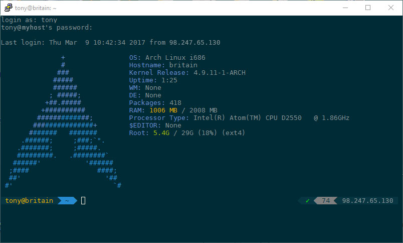

# PuTTY Solarized Settings

I've been looking for a way to make PuTTY less 1995 and more 2000's... So I looked around for some solarized palettes that would do the trick... The issue with the couple I found is that they are in some ways all incomplete.
Loading these settings you get All the solarized (dark) colors for PuTTY set using the [solarized scheme](http://ethanschoonover.com/solarized) from [Ethan Schoonover](http://ethanschoonover.com) from  for regular text and an alternate version for bold text. Additionally I threw in there some settings to make the window look nicer, such as removing the scroll bar. also Terminal Type is set to "xterm-256color"!

I hope you enjoy it.

## Installation

1. Download `putty-default-solarized-dark.reg
2. Double-click it
3. Click OK...
4. ...
5. Profit.

When you want to creat a new session with the solarized settings just load the "Default Solarized Dark" session in PuTTY and change your parameters, then save it.

Easy enough... 
