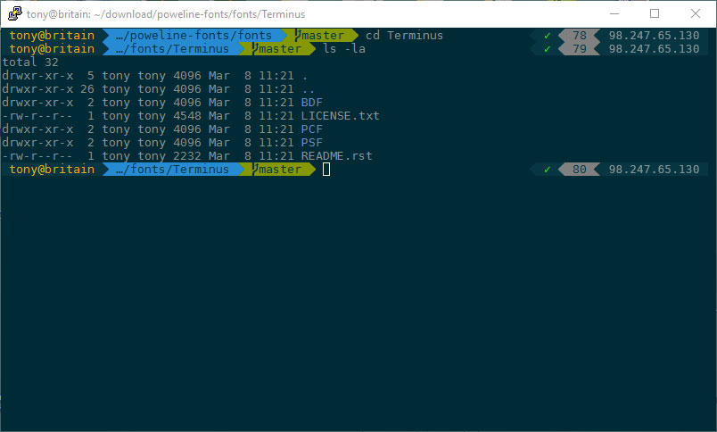

# PuTTY Solarized Settings

I've been looking for a way to make PuTTY less 1995 and more 2000's... So I looked around for some solarized palettes that would do the trick... The issue with the couple I found is that they are in some ways all incomplete.
Loading these settings you get All the solarized (dark) colors for PuTTY set using solarized standards for regular text and an alternate version for bold text. Additionally I threw in there some settings to make the window look nicer, such as removing the scroll bar. also Terminal Type is set to "xterm-256color"!

I hope you enjoy it.

